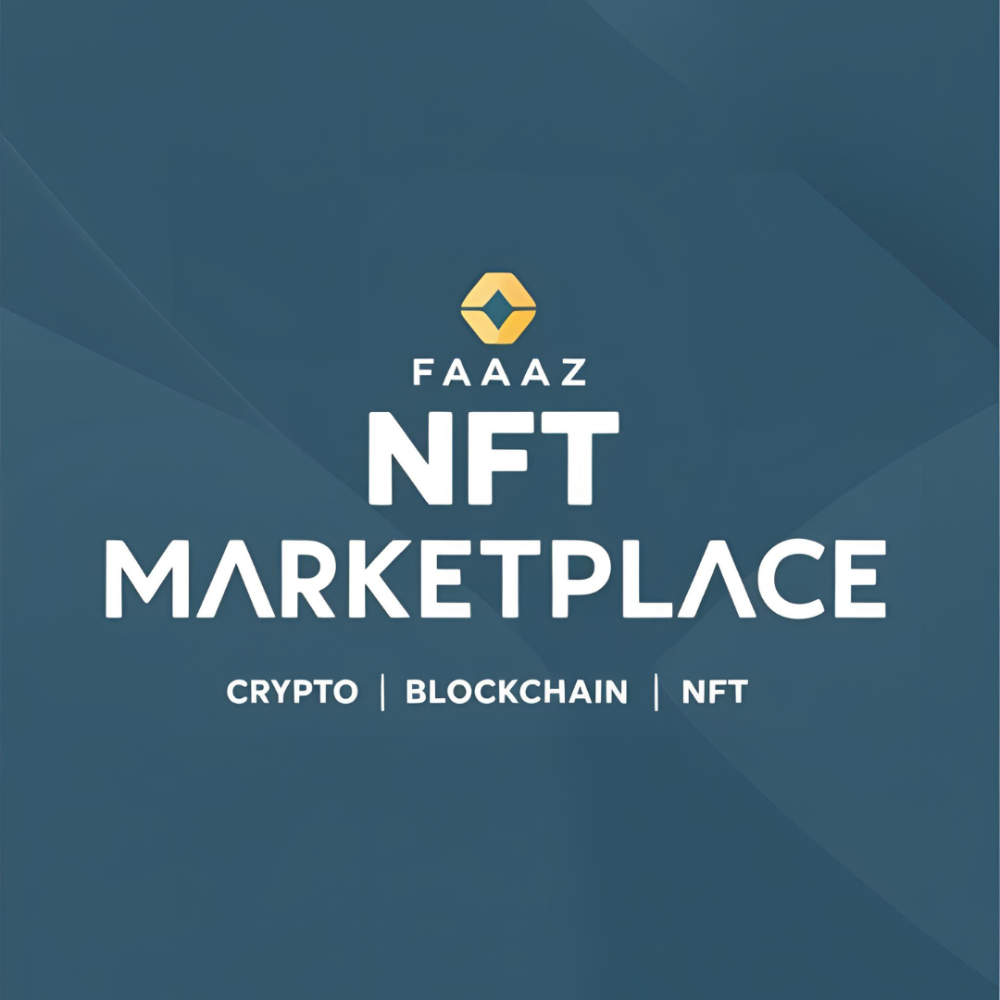

# Faaz NFT Marketplace

A decentralized NFT marketplace built using **Solidity**, **ERC-1155**, and **ERC-2981*- for minting, bidding/auction, royalties, and ownership management. This project allows creators to mint and auction their digital assets such as art, music, and videos with integrated royalties.

## Modules

- [Backend](./backend/README.md)
- [Frontend](./frontend/README.md)
